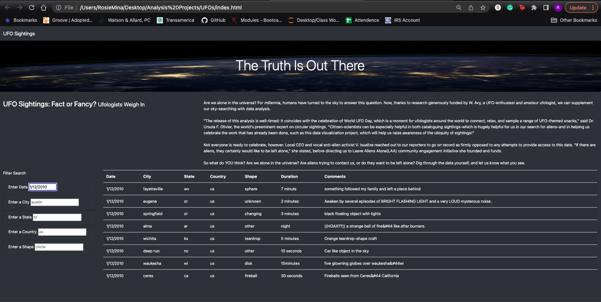

# UFOs - Is it possible that they are out there??

## Overview:

- During this project and analysis we made it possible to filter through potential sightings of UFOs by the date it took place and also location. We were even able to filter it by the shape of the object seen. The website built captures all this informational in a captivating way for users. 

## Results:

- To someone who is using the website for the first time, it might look a bit intimidating but the truth is, its very easy and simple to use. THe website is comprise of data from a ton of visuals of weird objects that people thought were UFOs. If someone wanted to check for especific information such as a particular state, or UFO shape or date that UFOs were seen, they'd just have to go to the left side of the screen and type in the information they are looking for. 
- As an example below i will show if i were someone interessted in seeing UFO sightings 01/12/2010 in Eugene, OR, I would type in the date in the date filter (as seen below), then i would type eugene in the city, then or in the state to represent Oregon

## SUMMARY:
- A major drawback to the website is that it doesn't pull data from a constantly updated source like through an API, instead it has a fixed data set. 

- 2 recommendations would be :
1) To connect the website with a data source that is being updated automatically 
2) As the user is typing letters into the filters it should popluate instead of waiting for the user to hit enter. 
